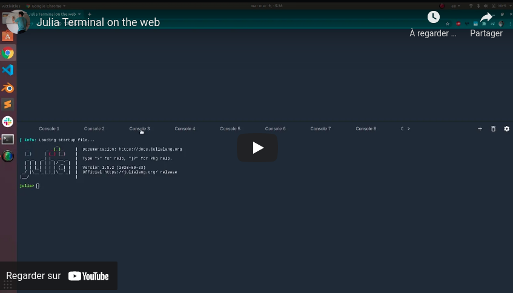

# Julia + Node.js + Xterm.js + React.js

Implementation of Julia console on the web.

## Instructions

First install all the necessary dependencies `npm install` on `server` and `client` folders.

Then, simply run 

```sh
npm run start
``` 

on both `server` and `client` folders.

There is also a simple script called `RUN.dev.sh` where you can run both servers with one command.

> For watching changes in the `server` you can instead run `npm run watch` to run a `nodemon` instance.

## Preview video

[](https://youtu.be/LVt18SACLuU)

## Resources

- [EasyDockerWeb](https://github.com/qfdk/EasyDockerWeb)

- [Evala](https://github.com/krasimir/evala)

- [Spacecraft](https://hackernoon.com/building-spacecraft-a-real-time-collaborative-repl-deebcf084ed9)
